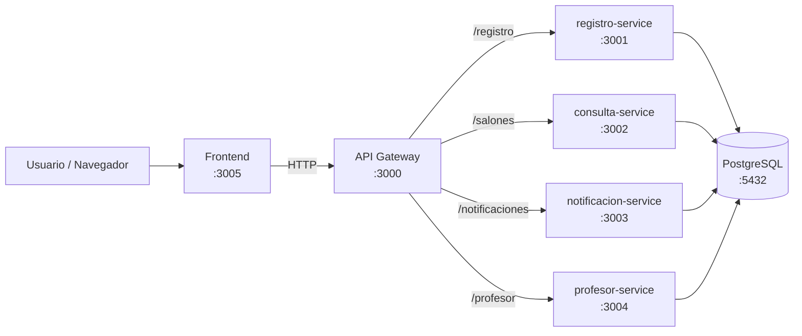

# Arquitectura de Contenedores (Alto Nivel)

Vista simplificada de la arquitectura para presentaciones y entendimiento rapido del flujo principal.

```mermaid
flowchart LR
    U[Usuario / Navegador]
    FE[Frontend\n:3005]
    GW[API Gateway\n:3000]

    RS[registro-service\n:3001]
    CS[consulta-service\n:3002]
    NS[notificacion-service\n:3003]
    PS[profesor-service\n:3004]

    PG[(PostgreSQL\n:5432)]

    U --> FE
    FE -->|HTTP| GW

    GW -->|/registro| RS
    GW -->|/salones| CS
    GW -->|/notificaciones| NS
    GW -->|/profesor| PS

    RS --> PG
    CS --> PG
    NS --> PG
    PS --> PG
```

